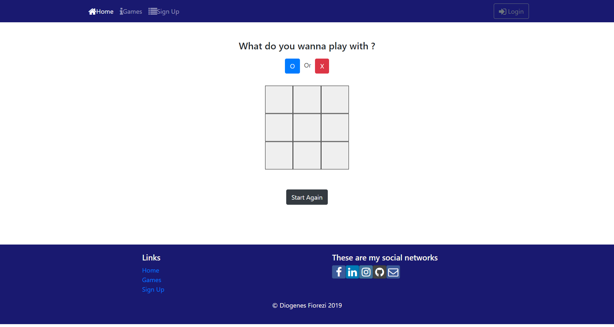

### This is a little project that I created right after learning the concepts of React
I was still testing some features and this project was made just to practice with what I had just learned at the time.

### What is really cool about it is the `Game` page, where you can choose between Tic-Tae-Toe or Rock-Paper-Scissors.

# Tic-Tac-Toe:
   
   
# Rock-Paper-Scissors:
   
   
### To run this application, you can just go to the root folder and run:
### `$ npm start`
